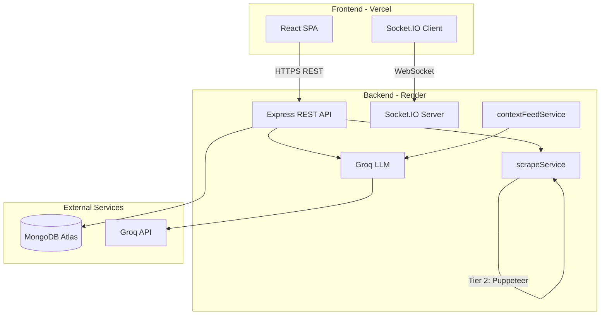
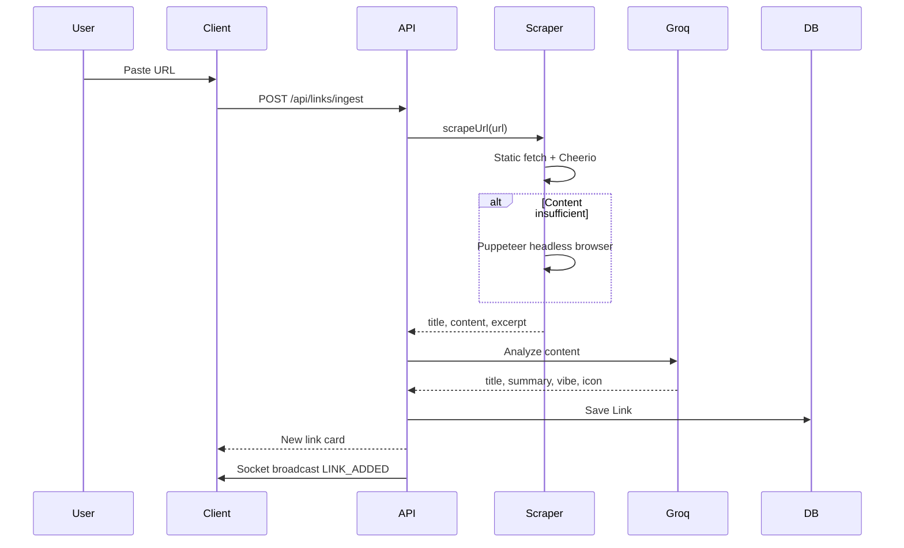

# ShelfLife

**The Resurrection of the Living Archive.**

ShelfLife is a social, AI-augmented link curation platform built to fight the "digital graveyard" of forgotten tabs and broken bookmarks. Instead of static lists, ShelfLife creates a living ecosystem that organizes itself, summarizes content with AI, and visually decays links that go unvisited.

---

## Table of Contents

- [Overview](#overview)
- [Features](#features)
- [Tech Stack](#tech-stack)
- [Architecture](#architecture)
- [Project Structure](#project-structure)
- [Prerequisites](#prerequisites)
- [Local Development](#local-development)
- [Environment Variables](#environment-variables)
- [API Reference](#api-reference)
- [Real-Time Events (Socket.IO)](#real-time-events-socketio)
- [AI & Web Scraping Pipeline](#ai--web-scraping-pipeline)
- [Biological Decay System](#biological-decay-system)
- [Deployment](#deployment)
- [Production URLs](#production-urls)
- [Troubleshooting](#troubleshooting)
- [License](#license)

---

## Overview

ShelfLife lets users save URLs, automatically scrape and summarize them with AI, classify them into semantic **vibes**, organize them into **projects**, share **collaborative rooms** in real time, and track relevance over time via a **Context Feed**. Links that are neglected fade visually and eventually move to the **Graveyard** (Compost Heap).

The application is split into:

| Layer | Technology | Role |
|-------|------------|------|
| Frontend | React + Vite | UI, routing, real-time client |
| Backend | Node.js + Express | REST API, auth, scraping, AI |
| Real-time | Socket.IO | Presence, cursors, live link updates |
| Database | MongoDB Atlas | Users, links, rooms, projects |
| AI | Groq (Llama 3.3 70B) | Summaries, vibes, context feed |
| Scraping | Cheerio + Puppeteer | Tiered URL content extraction |

---

## Features

### Link Ingestion & AI Analysis

- Paste any URL to scrape page content (static fetch first, headless browser fallback).
- Groq generates a **title**, **2–3 sentence summary**, **vibe category**, and **emoji icon**.
- Saved links store the extracted content for later AI refreshes.

### Semantic Vibe Engine

Links are auto-classified into mood pills:

`High-Signal` · `Educational` · `Chaotic` · `Cursed` · `Wholesome` · `Insightful` · `Controversial` · `Funny`

### Biological Decay

- **Days 0–14:** Full visibility (`decay: 0`).
- **Days 14–30:** Progressive fade (decay increases visually on cards).
- **Day 31+:** Link is auto-archived to the **Graveyard** if never restored.

Archived links can be restored or permanently deleted from the Graveyard.

### Personal Shelf & Projects

- **Personal shelf:** Private links scoped to your account.
- **Projects:** Folder-like groupings to organize links within personal or room scopes.
- Move links between projects; rename or delete projects.

### Collaborative Rooms

- Create password-protected **rooms** with a shareable `roomId`.
- Join existing rooms with room ID + password.
- **Public rooms:** Discover, fork, and trace room **lineage** (remix history).
- Room-scoped links are visible to all members.

### Real-Time Synapse (Socket.IO)

When inside a room, members get live updates:

- **Presence** — online member count
- **Shelf Weather** — `FOGGY` / `BREEZY` / `STORMY` based on room activity
- **Live cursors** — see where others are pointing
- **Emoji reactions** — react on link cards in real time
- **Link added broadcasts** — new ingested links appear instantly for everyone in the room

### Context Feed

Every saved link schedules an automatic relevance check (every 5 days). Groq assesses whether the content is still current, updated, stale, or has a successor URL. Statuses include:

`pending` · `up-to-date` · `updated` · `successor-found` · `stale` · `unclear`

### User Profiles

- View account stats and saved link history.
- **Profile tag:** AI-generated interest tag based on your saved link headings.

### Authentication

- Email + password registration and login.
- JWT-based auth (5-hour token expiry).
- Protected routes on the frontend; Bearer token on all private API routes.

---

## Tech Stack

### Frontend (`client/`)

| Tool | Purpose |
|------|---------|
| React 19 | UI framework |
| Vite 8 | Dev server & build tool |
| React Router 7 | Client-side routing |
| Axios | HTTP client |
| Socket.IO Client | Real-time features |
| Framer Motion | Animations |

### Backend (`server/`)

| Tool | Purpose |
|------|---------|
| Node.js 20+ | Runtime |
| Express 5 | REST API |
| Mongoose 9 | MongoDB ODM |
| Socket.IO 4 | WebSocket server |
| Groq SDK | LLM API |
| Cheerio | HTML parsing |
| Puppeteer Core + @sparticuz/chromium | JS-rendered page scraping |
| bcryptjs | Password hashing |
| jsonwebtoken | JWT auth |

---

## Architecture



### Request flow (link ingest)



---

## Project Structure

```
ShelfLife/
├── client/                    # React frontend
│   ├── public/                # Static assets (logo, icons)
│   ├── src/
│   │   ├── components/        # Navbar, SummaryModal, ProtectedRoute, etc.
│   │   ├── hooks/             # useSocket.js
│   │   ├── lib/               # api.js (Axios + env config)
│   │   ├── pages/             # Dashboard, Login, Register, RoomGate, Graveyard, Profile
│   │   ├── App.jsx            # Route definitions
│   │   └── main.jsx           # Entry point
│   ├── .env.example
│   └── vercel.json            # Vercel SPA routing
│
├── server/                    # Node.js backend
│   ├── config/
│   │   └── cors.js            # CORS allowlist (CLIENT_URL)
│   ├── controllers/           # Route handlers
│   ├── middlewares/
│   │   └── authMiddleware.js  # JWT verification
│   ├── models/                # Mongoose schemas (User, Link, Room, Project)
│   ├── routes/                # Express routers
│   ├── services/
│   │   ├── scrapeService.js   # Tiered web scraping
│   │   └── contextFeedService.js  # Scheduled AI relevance checks
│   ├── .env.example
│   └── server.js              # App entry + Socket.IO
│
├── render.yaml                # Render deployment blueprint
└── README.md
```

---

## Prerequisites

Before running locally or deploying:

- **Node.js 20+**
- **npm**
- **MongoDB Atlas** cluster (or local MongoDB)
- **Groq API key** — [console.groq.com](https://console.groq.com)
- **Git** (for deployment)

For local Puppeteer scraping (optional, Tier 2 fallback):

```bash
cd server && npx puppeteer browsers install chrome
```

---

## Local Development

### 1. Clone the repository

```bash
git clone https://github.com/Zaid5671/SL3.git
cd SL3
```

### 2. Backend setup

```bash
cd server
cp .env.example .env
```

Edit `server/.env`:

```env
MONGO_URI=mongodb+srv://...
JWT_SECRET=your-long-random-secret
GROQ_API_KEY=gsk_...
CLIENT_URL=http://localhost:5173
PORT=5000
```

```bash
npm install
npx puppeteer browsers install chrome   # optional, for JS-heavy sites locally
npm run dev
```

Server runs at **http://localhost:5000**

### 3. Frontend setup

Open a second terminal:

```bash
cd client
cp .env.example .env
# Leave VITE_API_URL and VITE_SOCKET_URL empty for local dev
npm install
npm run dev
```

App runs at **http://localhost:5173**

The Vite dev server proxies `/api/*` requests to `localhost:5000` automatically.

### 4. Verify

| Check | URL |
|-------|-----|
| Frontend | http://localhost:5173 |
| API health | http://localhost:5000/api/health |
| Register / Login | http://localhost:5173/register |

---

## Environment Variables

### Server (`server/.env`)

| Variable | Required | Default | Description |
|----------|----------|---------|-------------|
| `MONGO_URI` | Yes | — | MongoDB connection string |
| `JWT_SECRET` | Yes | — | Secret for signing JWT tokens |
| `GROQ_API_KEY` | Yes* | — | Groq API key for AI features |
| `CLIENT_URL` | Prod: Yes | `localhost:5173` | Comma-separated allowed frontend origins (CORS) |
| `PORT` | No | `5000` | HTTP port (Render sets automatically) |
| `SCRAPE_MIN_CONTENT_CHARS` | No | `200` | Min chars before Puppeteer escalation |
| `SCRAPE_STATIC_TIMEOUT_MS` | No | `15000` | Static fetch timeout |
| `SCRAPE_PUPPETEER_TIMEOUT_MS` | No | `30000` | Puppeteer page load timeout |
| `PUPPETEER_HEADLESS` | No | `true` | Set `false` to debug browser locally |

\*Without `GROQ_API_KEY`, ingestion still works but summaries fall back to placeholders; Context Feed shows `unclear`.

### Client (`client/.env`)

| Variable | Required (prod) | Local dev | Description |
|----------|-----------------|-----------|-------------|
| `VITE_API_URL` | Yes | Empty | Backend base URL (e.g. `https://shelflife3.onrender.com`) |
| `VITE_SOCKET_URL` | Yes | Empty | Socket.IO URL (usually same as API URL) |

> **Note:** Vite embeds `VITE_*` variables at **build time**. Changing them on Vercel requires a **redeploy**.

---

## API Reference

All private routes require header:

```
Authorization: Bearer <jwt_token>
```

### Users

| Method | Endpoint | Auth | Description |
|--------|----------|------|-------------|
| `POST` | `/api/users/register` | No | Register `{ username, email, password }` |
| `POST` | `/api/users/login` | No | Login `{ email, password }` → `{ token }` |
| `GET` | `/api/users/profile` | Yes | Current user profile + stats |

**Login errors:**
- Wrong password → `{ message: "Wrong password" }`
- Unknown email → `{ message: "Invalid credentials" }`

### Links

| Method | Endpoint | Auth | Description |
|--------|----------|------|-------------|
| `POST` | `/api/links/ingest` | Yes | Scrape & save URL `{ url, roomId?, scope?, projectId? }` |
| `GET` | `/api/links` | Yes | List links (`?roomId=`, `?archived=true`) |
| `DELETE` | `/api/links/:id` | Yes | Permanently delete a link |
| `PUT` | `/api/links/:id/archive` | Yes | Archive link to Graveyard |
| `PUT` | `/api/links/:id/restore` | Yes | Restore from Graveyard |
| `PUT` | `/api/links/:id/project` | Yes | Move link to a project |

### Rooms

| Method | Endpoint | Auth | Description |
|--------|----------|------|-------------|
| `POST` | `/api/rooms/create` | Yes | Create room `{ name, password }` |
| `POST` | `/api/rooms/join` | Yes | Join room `{ roomId, password }` |
| `GET` | `/api/rooms/public` | Yes | List public rooms |
| `POST` | `/api/rooms/:roomId/fork` | Yes | Fork a public room |
| `GET` | `/api/rooms/:roomId/lineage` | Yes | Room remix lineage tree |
| `PUT` | `/api/rooms/:roomId/visibility` | Yes | Toggle public/private |

### Projects

| Method | Endpoint | Auth | Description |
|--------|----------|------|-------------|
| `POST` | `/api/projects` | Yes | Create project folder |
| `GET` | `/api/projects` | Yes | List projects for scope |
| `PUT` | `/api/projects/:id` | Yes | Rename project |
| `DELETE` | `/api/projects/:id` | Yes | Delete project |

### Health

| Method | Endpoint | Auth | Description |
|--------|----------|------|-------------|
| `GET` | `/api/health` | No | `{ message: "SHELFLIFE Server is alive!" }` |

---

## Real-Time Events (Socket.IO)

Connect with JWT in handshake:

```js
io(SOCKET_URL, { auth: { token } });
```

After connect, join a room:

```js
socket.emit("JOIN_ROOM", { roomId: "ABC123" });
```

### Client → Server events

| Event | Payload | Description |
|-------|---------|-------------|
| `JOIN_ROOM` | `{ roomId }` | Join a collaborative room |
| `CURSOR_MOVE` | `{ x, y }` | Broadcast cursor position |
| `EMOJI_REACTION` | `{ cardId, emoji }` | React on a link card |
| `ACTIVITY_PING` | — | Increment room activity meter |

### Server → Client events (via `message`)

| Type | Description |
|------|-------------|
| `INIT` | Connection confirmed with socketId and online count |
| `PRESENCE` | Updated online member count |
| `CURSOR_MOVE` | Another user's cursor position |
| `LINK_ADDED` | New link ingested in this room |
| `EMOJI_REACTION` | Emoji reaction on a card |
| `WEATHER_UPDATE` | Shelf weather changed (`FOGGY` / `BREEZY` / `STORMY`) |

---

## AI & Web Scraping Pipeline

### Scraping (`server/services/scrapeService.js`)

Tiered fallback chain:

1. **Tier 1 — Static:** HTTP fetch with browser-like headers → Cheerio extraction (OG tags, JSON-LD, `article`/`main` selectors).
2. **Tier 2 — Puppeteer:** Headless Chromium for JS-rendered pages (local: full Puppeteer; cloud: `@sparticuz/chromium`).

### AI (`Groq` — `llama-3.3-70b-versatile`)

| Use case | Trigger |
|----------|---------|
| Link summary + vibe + icon | On ingest |
| Vibe re-classification | After summary generation |
| Profile tag | After ingest (from user's link headings) |
| Context Feed refresh | Every 5 days per link (background sweep) |

---

## Biological Decay System

Decay is computed server-side when links are fetched:

| Age (days since save) | Behavior |
|-----------------------|----------|
| 0–14 | `decay: 0` — full visibility |
| 14–30 | Decay ramps from 0 → 100 (visual fade on cards) |
| 31+ | Auto-archived to Graveyard (`isArchived: true`) |

Restoring a link resets decay to `0`.

---

## Deployment

ShelfLife is designed for **Vercel (frontend)** + **Render (backend)** + **MongoDB Atlas**.

### Architecture (production)

```
Browser → sl-3.vercel.app (React SPA)
              ↓ VITE_API_URL / VITE_SOCKET_URL
         shelflife3.onrender.com (Express + Socket.IO)
              ↓
         MongoDB Atlas + Groq API
```

### Backend — Render

1. Connect GitHub repo on [Render](https://render.com).
2. Use [`render.yaml`](render.yaml) blueprint **or** create a Web Service manually:
   - **Root Directory:** `server`
   - **Build Command:** `npm install`
   - **Start Command:** `npm start`
   - **Health Check Path:** `/api/health`
   - **Plan:** Starter+ recommended (Puppeteer needs memory)
3. Set environment variables:

| Variable | Example |
|----------|---------|
| `MONGO_URI` | MongoDB Atlas connection string |
| `JWT_SECRET` | Long random string |
| `GROQ_API_KEY` | Your Groq key |
| `CLIENT_URL` | `https://sl-3.vercel.app` |
| `NODE_ENV` | `production` |

4. **MongoDB Atlas:** Network Access → allow `0.0.0.0/0` (or Render's IP range).

### Frontend — Vercel

1. Import repo on [Vercel](https://vercel.com).
2. **Root Directory:** `client`
3. **Framework:** Vite
4. Environment variables:

| Variable | Value |
|----------|-------|
| `VITE_API_URL` | `https://shelflife3.onrender.com` |
| `VITE_SOCKET_URL` | `https://shelflife3.onrender.com` |

5. Deploy. [`client/vercel.json`](client/vercel.json) handles SPA routing.

### Post-deploy wiring

1. Set `CLIENT_URL` on Render to your exact Vercel URL (no trailing slash).
2. Redeploy Render after changing `CLIENT_URL`.
3. Redeploy Vercel after changing any `VITE_*` variable.

### Deploying code updates

| Changed folder | Auto-deploys on push to `main` |
|----------------|-------------------------------|
| `client/` | Vercel |
| `server/` | Render |

---

## Production URLs

| Service | URL |
|---------|-----|
| Frontend | https://sl-3.vercel.app |
| Backend API | https://shelflife3.onrender.com |
| Health check | https://shelflife3.onrender.com/api/health |

---

## Troubleshooting

### Local

| Problem | Solution |
|---------|----------|
| API calls fail on localhost | Ensure backend is running on port 5000 |
| Scraping fails locally | Run `npx puppeteer browsers install chrome` in `server/` |
| MongoDB connection error | Check `MONGO_URI` and Atlas network access |
| Login shows no error | Hard refresh; check browser console Network tab |

### Production

| Problem | Solution |
|---------|----------|
| CORS error in browser | `CLIENT_URL` on Render must exactly match your Vercel URL |
| Login/API 404 on Vercel | Set `VITE_API_URL`; redeploy Vercel |
| Socket.io won't connect | Set `VITE_SOCKET_URL`; redeploy Vercel |
| Slow first request | Render cold start (~30–60s after idle) — normal on free/starter |
| Scraping fails on Render | Use Starter plan; cloud uses `@sparticuz/chromium` automatically |
| Context Feed stuck on `pending` | Verify `GROQ_API_KEY` is set on Render |

### Using from multiple devices

Open the Vercel URL on any laptop or browser. Log in with the same account — data syncs via MongoDB Atlas. Each device stores its own JWT in `localStorage` (expires after 5 hours).

---

## License

This project is for personal and portfolio use. Add a license file if you plan to open-source it formally.

---

<p align="center">
  Built with curiosity. Organized by AI. Decayed by neglect.
</p>
