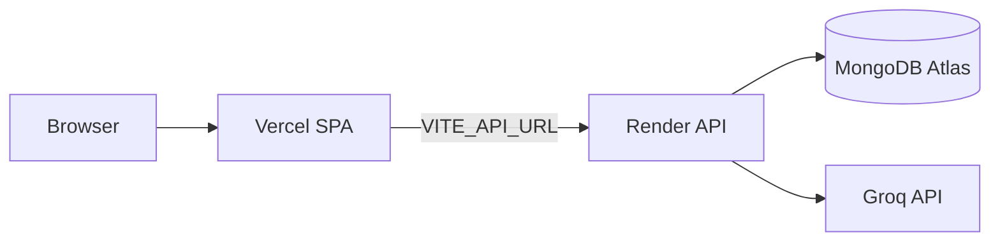

# SHELFLIFE

**The Resurrection of the Living Archive.**

SHELFLIFE is a social, AI-augmented curation engine built to fight the "Digital Graveyard" of forgotten tabs and broken bookmarks. Instead of static lists, SHELFLIFE creates a living, breathing ecosystem that organizes itself, summarizes the noise, and physically decays if neglected.

### Core Features

- **Autonomous AI Ingestion:** Drop a URL, and the backend scrapes metadata and uses GenAI to generate a summary.
- **Biological Decay:** Links that remain unclicked fade and eventually move to a Compost Heap.
- **Semantic Vibe-Engine:** Links are auto-classified into visual "Mood Pills" (e.g., Educational, Chaotic).
- **Real-Time Synapse:** Multiplayer shared workspace powered by WebSockets.

### Tech Stack

- **Frontend:** React, Vite
- **Backend:** Node.js, Express, Socket.io, Puppeteer
- **Database:** MongoDB Atlas, Mongoose
- **AI:** Groq (Llama 3.3 70B)

---

## Local Development

### Prerequisites

- Node.js 20+
- MongoDB Atlas cluster (or local MongoDB)
- Groq API key

### Setup

1. **Backend**

```bash
cd server
cp .env.example .env
# Fill in MONGO_URI, JWT_SECRET, GROQ_API_KEY in .env
npm install
npx puppeteer browsers install chrome
npm run dev
```

2. **Frontend** (separate terminal)

```bash
cd client
cp .env.example .env
# Leave VITE_API_URL empty for local dev (Vite proxies /api to localhost:5000)
npm install
npm run dev
```

3. Open http://localhost:5173

---

## Deployment (Vercel + Render)

Deploy the **frontend on Vercel** and the **backend on Render**. The client talks to Render via environment variables.



### 1. Deploy backend on Render

1. Push this repo to GitHub.
2. In [Render](https://render.com), create a **Blueprint** from the repo (uses [`render.yaml`](render.yaml))  
   **or** create a **Web Service** manually:
   - **Root Directory:** `server`
   - **Build Command:** `npm install && npx puppeteer browsers install chrome`
   - **Start Command:** `npm start`
   - **Health Check Path:** `/api/health`
3. Set environment variables in Render:

| Variable | Value |
|----------|-------|
| `MONGO_URI` | Your MongoDB Atlas connection string |
| `JWT_SECRET` | Long random secret string |
| `GROQ_API_KEY` | Your Groq API key |
| `CLIENT_URL` | Your Vercel URL, e.g. `https://your-app.vercel.app` |
| `NODE_ENV` | `production` |

4. Copy your Render service URL, e.g. `https://shelflife-api.onrender.com`

**Note:** Puppeteer needs enough memory. Use at least Render's **Starter** plan (512MB+) for reliable link scraping.

### 2. Deploy frontend on Vercel

1. Import the repo in [Vercel](https://vercel.com).
2. Configure the project:
   - **Root Directory:** `client`
   - **Framework Preset:** Vite
   - **Build Command:** `npm run build`
   - **Output Directory:** `dist`
3. Set environment variables in Vercel:

| Variable | Value |
|----------|-------|
| `VITE_API_URL` | Your Render URL, e.g. `https://shelflife-api.onrender.com` |
| `VITE_SOCKET_URL` | Same as `VITE_API_URL` |

4. Deploy. Vercel uses [`client/vercel.json`](client/vercel.json) for SPA routing.

### 3. Final wiring

1. Set `CLIENT_URL` on Render to your live Vercel URL (must match exactly, no trailing slash).
2. Redeploy Render if you update `CLIENT_URL`.
3. Visit your Vercel URL, register, and test link ingestion.

### Troubleshooting

| Issue | Fix |
|-------|-----|
| CORS errors in browser | Ensure `CLIENT_URL` on Render matches your Vercel URL exactly |
| Login/API fails | Confirm `VITE_API_URL` is set on Vercel and points to Render |
| Socket.io won't connect | Set `VITE_SOCKET_URL` to the same Render URL; Render supports WebSockets |
| Scraping fails on Render | Upgrade to Starter plan; ensure Chrome installed via build command |
| Render cold starts | Free tier spins down after inactivity; first request may be slow |

---

## Environment Variables Reference

### Server (`server/.env`)

See [`server/.env.example`](server/.env.example).

### Client (`client/.env`)

See [`client/.env.example`](client/.env.example).
